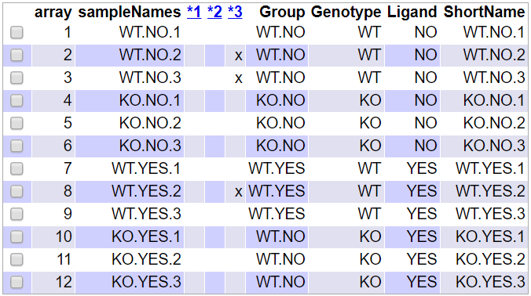
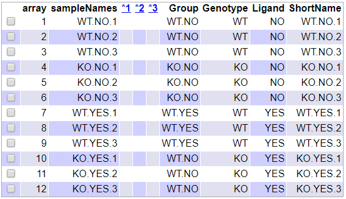

```{r installBioC, message=FALSE, warning=FALSE, eval=FALSE, echo = F}
if (!requireNamespace("BiocManager", quietly = TRUE))
    install.packages("BiocManager")
BiocManager::install()
```

```{r installPackages, message=FALSE, warning=FALSE, eval=FALSE, echo = F}
install.packages("knitr")
install.packages("ggplot2")
install.packages("ggrepel")
install.packages("BiocManager")
BiocManager::install("oligo")
BiocManager::install("pd.mogene.2.0.st")
BiocManager::install("arrayQualityMetrics")
BiocManager::install("limma")
BiocManager::install("genefilter")
BiocManager::install("mogene20sttranscriptcluster.db")
BiocManager::install("org.Mm.eg.db")
BiocManager::install("ReactomePA")
BiocManager::install("reactome.db")
```


```{r setup, include=FALSE}
library(knitr)
opts_chunk$set(comment = NA,
               echo = T,
               prompt = T,
               message = F, 
               warning = F,
               cache = T)
```

```{r libraries, include = F, message = F, warning = F}
# Load packages
library(ggplot2)
library(ggrepel)
library(Biobase)
library(oligo)
library(genefilter)
library(limma)
library(ReactomePA)
library(reactome.db)
library(arrayQualityMetrics)
library(pd.mogene.2.0.st)
library(mogene20sttranscriptcluster.db)
library(org.Mm.eg.db)
```

\newpage

# Abstract

In this work, a characteristic workflow for the analysis of microarray data using R software and Bioconductor packages is presented. Data analysed provides from a study in which the activity of the PRDM16 transcription factor is analysed in *Mus musculus*, in presence or not of the antidiabetic drug Rosiglitazone. Obtained results show that the expression of a considerable amount of genes is up or down-regulated by the deletion of the transcription factor or the presence of the drug.   

# Aim of the study

This study has mainly two goals:

- To carry out a statistical analysis of microarray data
- To use the knowledge gained on the statistical analysis to write a scientific technical report 

# Materials

In this section, all materials required to perform the microaray data analysis are listed.

## Software

Software used to carry out required calculations is [R statistical software](https://cran.r-project.org/index.html) on its `r paste(version$major, version$minor, sep = ".")` version. Since R is a console based software, [RStudio](https://rstudio.com/) additional interface is  used in this study to enhance significantly its performance.

Analysis carried out requires the use of functions not included in the basic R installation. Therefore, additional libraries or packages developed by the scientific community and containing these functions have to be imported. Most used packages are part of the [Bioconductor project](https://www.bioconductor.org/), the state-of-the-art approach to study microarrays and other omics data. 

Both R and Bioconductor are open source free software.

Code for running the statistical analysis can be downloaded from [GitHub](https://github.com/), a website that provides hosting for software development version control using Git. The url for the repository is: [https://github.com/ricardtorralba/torralba_gombau_ADO_PEC1.git](https://github.com/ricardtorralba/torralba_gombau_ADO_PEC1.git). 

## Data

Presented protocol is applied on a dataset of the @kissig2017prdm16 published study. Raw microarray data is available into the [Gene Expression Omnibus (GEO)](https://www.ncbi.nlm.nih.gov/geo/) database -@Clough2016 identified with the accession number **GSE86016**.

The study investigates the activity of the **PRDM16** transcription factor, which is known to be responsible for the activation of brown fat-specific genes and the repression of white fat and muscle-specific genes in adipocytes. Male 6-7 weeks old mice with the transcription factor deleted (`KO` or *knockout*) or not (`WO` or *wild type*), and undergoing (`YES`) or not (`NO`) treatment with the antidiabetic drug Rosiglitazone are compared.

It is a $2 \times 2$ factorial design with two variables: genotype and presence of the antidiabetic drug Rosiglitazone. Each of them contains two levels: wild type and *PRDM16* knockaut for the genotype; and presence or absence of the drug. Since each of the groups contains three replicates, the sample size of the experiment is `r params$samples`.  

Microarrays used were the transcript gene version of Mouse Gene 2.0 ST by *Affymetrix*.

# Methods

## Exploration and preparation of data

In the first step of the analysis, data provided by the researchers are explored in order to identify the number of groups and samples in the study.

```{r, echo = F}
targets = read.csv2("data/targets_cor.csv",
                    header = T,
                    sep = ";")
kable(targets,
      caption = "Group at which each of the samples belongs")
```

Factorial $2 \times 2$ design already presented in the `Data` section is confirmed, with three replicates per group, thus yielding a `r params$samples` samples study. The four diferent groups arise from the factorial design, with *PRDM16* genotype being either wild type or knockout; and the drug being present or not.

```{r, echo = F, results='hide'}
celFiles = list.celfiles("./data",
                         full.names = T)
my.targets = read.AnnotatedDataFrame("data/targets_cor.csv",
                                     header = T,
                                     row.names = 1,
                                     sep = ";")
rawData = read.celfiles(celFiles,
                        phenoData = my.targets)
rownames(pData(rawData)) = my.targets@data$ShortName
colnames(rawData) = rownames(pData(rawData))
```

## Quality control of raw data

After raw data are obtained and properly arranged, a quality control is performed on them before the normalization step. This control is of paramount importance, and consists mainly in plotting the raw data in order to check that all results obtained from the microarray have enough quality.

One of the most common approaches is to use the `arrayQualityMetrics()` function from the `arrayQualityMetrics` R package @kauffmann2009arrayqualitymetrics. It defines several thresholds to evaluate the quality of the array obtained raw data. If a single array is marked three times its quality should be carefully reviewed. 

```{r, echo = F}
arrayQualityMetrics(rawData,
                    outdir = "./results/QCDir.Raw",
                    force = T)
```

Next Figure shows the results obtained with the function on the quality control of the raw data.

```{r, echo = F, fig.align = 'center',fig.cap = "Quality analysis produced by the arrayQualityMetrics package on the raw data."}

```

It can be seen that none of the `r params$samples` microarrays is marked three times, thus all of them being able to be kept for the analysis.

After carrying out the previous basic analysis on the raw data, intensity distribution for each of the arrays can be visualized using boxplots.

```{r, echo = F, fig.width = 7.5, fig.height = 4.5, fig.align = 'center', fig.cap = "Intensity distribution of the arrays raw data."}
boxplot(rawData, 
        cex.axis = .8,
        las = 2,
        which = "all",
        col = c(rep("red", 3), rep("blue", 3), rep("green", 3), rep("yellow", 3)),
        main = "Distribution of raw instensity values")
```

As expected for the raw data, there is a noticeable although light variation of intensity among arrays.

In order to deepen the study of the raw data, the analysis of the first two principal components is carried out, based on the function designed at the Case Study provided as example.

```{r rawpca, echo = F, fig.width = 7, fig.height = 4.5, fig.align = 'center', fig.cap = "Principal Component Analysis for the raw data."}
plotPCA = function (datos, labels, factor, title, scale, colours, size = 1.5, glineas = 0.25) {
  data = prcomp(t(datos), scale = scale)
  dataDf = data.frame(data$x)
  Group = factor
  loads = round(data$sdev^2/sum(data$sdev^2)*100, 1)
  p1 = ggplot(dataDf,aes(x = PC1, y = PC2)) +
    theme_classic() +
    geom_hline(yintercept = 0, color = "gray70") +
    geom_vline(xintercept = 0, color = "gray70") +
    geom_point(aes(color = Group), alpha = 0.55, size = 3) +
    coord_cartesian(xlim = c(min(data$x[,1])-5, max(data$x[,1])+5)) +
    scale_fill_discrete(name = "Group")
  p1 + geom_text_repel(aes(y = PC2 + 0.25, label = labels), segment.size = 0.25, size = size) + 
    labs(x = c(paste("PC1", loads[1], "%")), y = c(paste("PC2", loads[2], "%"))) +  
    ggtitle(title) + 
    theme(plot.title = element_text(hjust = 0.5)) +
    scale_color_manual(values = colours)
  }

plotPCA(exprs(rawData),
        labels = targets$ShortName,
        factor = targets$Group,
        title = "Raw data PCA",
        scale = F,
        size = 3,
        colours = c("red", "blue", "green", "yellow"))
```

```{r, echo = F, results = 'hide'}
pca_raw = prcomp(t(exprs(rawData)))
loads_raw = round(pca_raw$sdev^2/sum(pca_raw$sdev^2)*100, 1)
```

As it can be seen in the Figure, first component accounts for `r loads_raw[1]`% of the samples total variability. This variability is mainly due to the presence or not of the rosiglitazone drug.

## Data normalization

Data normalization is the group of techniques that allow to reduce systematic error in the samples results, so that, to the extent possible, all differences between samples are due to biological variation within them.

```{r, echo = F, results = "hide"}
data_rma = rma(rawData)
```

## Quality control of normalized data

After normalization step is performed, `arrayQualityMetrics` function from the `arrayQualityMetrics` package is applied to normalized data in order to chech again for its quality.

```{r, echo = F}
arrayQualityMetrics(data_rma,
                    outdir = "./results/QCDir.Norm",
                    force = T)
```

```{r, echo = F, fig.align = 'center',fig.cap = "Quality analysis for the normalized data produced by the arrayQualityMetrics package."}

```

It can be seen that none of the `r params$samples` microarrays is marked in any of the quality analyses. Data quality is reliable.

```{r, echo = F, fig.width = 7.5, fig.height = 4.5, fig.align = 'center', fig.cap = "Intensity distribution of the arrays normalized data."}
boxplot(data_rma, 
        cex.axis = .8,
        las = 2,
        which = "all",
        col = c(rep("red", 3), rep("blue", 3), rep("green", 3), rep("yellow", 3)),
        main = "Distribution of normalized instensity values")
```

As expected for raw data, there is a noticeable although light variation of intensity among arrays.

In order to deepen the study of the raw data, a principal components analysis based on the function designed at the Case study is carried out.

```{r, echo = F, fig.width = 7, fig.height = 4.5, fig.align = 'center', fig.cap = "Principal Component Analysis for the normalized data."}
plotPCA(exprs(data_rma),
        labels = targets$ShortName,
        factor = targets$Group,
        title = "Normalized data PCA",
        scale = F,
        size = 3,
        colours = c("red", "blue", "green", "yellow"))
```

```{r, echo = F, results = "hide"}
pca_norm = prcomp(t(exprs(data_rma)))
loads_norm = round(pca_norm$sdev^2/sum(pca_norm$sdev^2)*100, 1)
norm_reduction = loads_raw[1] - loads_norm[1]
```

After normalization of the data, total variability accounted by the first component has been reduced to `r loads_norm[1]`%. This is a reduction of `r norm_reduction` percentual points when compared to the raw data. However, variability in the first component is again mainly due to the rosiglitazone drug.

## Least variable genes filtration

Filtering least variable genes allows to delete from the study those genes that are not differently expressed between samples. In this way, the total number of tests to be performed in the identification of most differentially expressed genes is reduced, thus increasing the power of the analysis. In this case, both genes not differently expressed and without an Enterez Gene ID annotation are filtered out.

```{r, echo = F}
annotation(data_rma) = "mogene20sttranscriptcluster.db"
filtered = nsFilter(data_rma,
                    require.entrez = T,
                    remove.dupEntrez = T,
                    var.filter = T,
                    var.func = IQR,
                    var.cutoff = .75,
                    filterByQuantile = T,
                    feature.exclude = "^AFFX")
data_filtered = filtered$eset
after_filtered_genes = dim(exprs(data_filtered))[1]
```

After filtration has been carried out, there are `r after_filtered_genes` genes under study.

## Most differentially expressed genes identification

Linear Models for Microarray method, implemented in the `limma` package @Smyth2005 is used to make the selection of differentialy expressed genes.

Within this approach, the first step consists in creating the design matrix, a table that describes the alloacation of each sample to an experimental condition. This matrix has as many rows as samples in the study and as many columns as the sum of total groups in the study considering each of the factors. Therefore, in this particular case, the design matrix will have `r params$samples` rows and `r params$groups` columns. Each row contains a one in the column of the group to which the sample belongs, and a zero in the other columns.

Design matrix for the study is presented:

```{r, echo = F}
designMat = model.matrix(~0 + Group,
                         pData(data_filtered))
colnames(designMat) = c("KO.NO", "KO.YES", "WT.NO", "WT.YES")
designMat[,]
```

Given a linear model defined through a design matrix, any question of interest arising for the study can be answered by doing comparisons between the parameters in the model. Therefore, parametrization process is crucial in order to define the comparisons which are of interest.

In this particular case, the study is focused on three aspects:

- The effect of knocking out the transcription factor PRDM16.
- The effect of using the antidiabetic drug Rosiglitazone.
- A test on whether there is an interaction between the previous factors.

The contrasts matrix is the tool used to describe the comparisons between groups. It contains as many columns as comparisons are to be done, and as many rows as groups in the study.

Contrasts matrix is presented:

```{r, echo = F}
contrastMat = makeContrasts (KOvsWT.NO = KO.NO - WT.NO,
                             KOvsWT.YES = KO.YES - WT.YES,
                             INT = (KO.NO - WT.NO) - (KO.YES - WT.YES),
                             levels = designMat)
contrastMat
```

After the design and the contrasts matrices have been defined, next step is to estimate the model, estimate the contrasts and perform significance tests that will show, for each gene and each of the comparisons, if the gen can be considered to have a different level of expression.

Method implemented in the `limma` package broadens the traditional analysis using empirical Bayes models to improve the error estimated values. It also provides Fold-change t-moderated and adjusted p-values in order to distinguish most differently expressed genes in each of the conditions under study.

With the purpose of reducing the amount of false positives results that may be obtained from a high number of contrasts computed simultaneously, adjusted p-values are calculated by using the Benjamini and Hochberg method @Benjamini1995.

```{r, echo = F}
fit = lmFit(data_filtered, designMat)
fit.main = contrasts.fit(fit, contrastMat)
fit.main = eBayes(fit.main)
```

Genes that are most differently expressed when PRDM16 transcription factor is deleted and the antidiabetic drug Rosiglitazone is not present, are presented in the the following table: 

```{r, echo = F}
topTab_KOvsWT.NO = topTable(fit.main,
                            number = nrow(fit.main),
                            coef = "KOvsWT.NO",
                            adjust = "fdr")
kable(head(topTab_KOvsWT.NO, 10),
      caption = "Genes most differently expressed when PRDM16 transcription factor is deleted and Rosiglitazone is not present")
```

Genes that are most differently expressed when PRDM16 transcription factor is deleted and the antidiabetic drug Rosiglitazone is present are shown next: 

```{r, echo = F}
topTab_KOvsWT.YES = topTable(fit.main,
                             number = nrow(fit.main),
                             coef = "KOvsWT.YES",
                             adjust = "fdr")
kable(head(topTab_KOvsWT.YES, 10),
      caption = "Genes most differently expressed when PRDM16 transcription factor is deleted and Rosiglitazone is present")
```

Finally, the interaction between the variables is tested. Genes that are most differently expressed between the first and the second comparison are presented in the following table:

```{r, echo = F}
topTab_INT = topTable(fit.main,
                      number = nrow(fit.main),
                      coef = "INT",
                      adjust = "fdr")
kable(head(topTab_INT, 10),
      caption = "Genes most differently expressed between the previous two comparisons")
```

Obtained results on each of the three comparisons can be presented with a Volcano plot, showing the names of the most up-regulated and down-regulated genes. The names of the top 5 genes are shown in each plot.

```{r, echo = F}
geneSymbols = select(mogene20sttranscriptcluster.db,
                     rownames(fit.main),
                     c("SYMBOL"))
SYMBOLS = geneSymbols$SYMBOL
```

```{r, echo = F, fig.align = 'center', fig.cap = "PRDM16 KO and Rosiglitazone not present"}
volcanoplot(fit.main,
            coef = 1,
            highlight = 5,
            names = SYMBOLS,
            main = paste("Differentially expressed genes",
                         colnames(contrastMat)[1],
                         sep = " "))
abline(v = c(-1,1))
```

```{r, echo = F, fig.align = 'center', fig.cap = "PRDM16 WT and Rosiglitazone present"}
volcanoplot(fit.main,
            coef = 2,
            highlight = 5,
            names = SYMBOLS,
            main = paste("Differentially expressed genes",
                         colnames(contrastMat)[2],
                         sep = " "))
abline(v = c(-1,1))
```

```{r, echo = F, fig.align = 'center', fig.cap = "Interaction between factors"}
volcanoplot(fit.main,
            coef = 3,
            highlight = 5,
            names = SYMBOLS,
            main = paste("Differentially expressed genes",
                         colnames(contrastMat)[3],
                         sep = " "))
abline(v = c(-1,1))
```

## Gene Annotation

After most differently expressed genes have been defined for each of the comparisons, it is useful to provide additional information on the selected features. Within the gene annotation process, most differently expressed genes are presented with more familiar names such as the Gene Symbol and the Enterez Gene ID, or given a suitable description. Therefore, annotation makes tables more comprehensible.

Function `annotatedTopTable` provided at the Case Study is used in order to carry out gene annotation.

```{r, echo = F}
annotatedTopTable = function(topTab, anotPackage){
  topTab = cbind(PROBEID = rownames(topTab),
                 topTab)
  myProbes = rownames(topTab)
  thePackage = eval(parse(text = anotPackage))
  geneAnots = select(thePackage,
                     myProbes,
                     c("SYMBOL", "ENTREZID", "GENENAME"))
  annotatedTopTab = merge(x = geneAnots,
                          y = topTab,
                          by.x = "PROBEID",
                          by.y = "PROBEID")
  return(annotatedTopTab)
}
```

```{r, echo = F}
topAnnotated_KOvsWT.NO = annotatedTopTable(topTab_KOvsWT.NO,
                                           anotPackage = "mogene20sttranscriptcluster.db")
topAnnotated_KOvsWT.YES = annotatedTopTable(topTab_KOvsWT.YES,
                                            anotPackage = "mogene20sttranscriptcluster.db")
topAnnotated_INT = annotatedTopTable(topTab_INT,
                                     anotPackage = "mogene20sttranscriptcluster.db") 
```

Most differently expressed genes when PRDM16 is KO and Rosiglitazone is not present are presentated properly annotated in the following table:

```{r, echo = F}
low_adjusted_pvalue_KOvsWT.NO = head(order(topAnnotated_KOvsWT.NO$adj.P.Val), 10)
kable(topAnnotated_KOvsWT.NO[low_adjusted_pvalue_KOvsWT.NO, c(1:4,9)],
      caption = "Annotated most differently expressed genes when PRDM16 transcription factor is deleted and Rosiglitazone is not present")
```

Most differently expressed genes when PRDM16 is KO and Rosiglitazone is present are presentated properly annotated in the following table:

```{r, echo = F}
low_adjusted_pvalue_KOvsWT.YES = head(order(topAnnotated_KOvsWT.YES$adj.P.Val), 10)
kable(topAnnotated_KOvsWT.YES[low_adjusted_pvalue_KOvsWT.YES, c(1:4,9)],
      caption = "Annotated most differently expressed genes when PRDM16 transcription factor is deleted and Rosiglitazone is present")
```

In the last table of the section, most differently expressed genes between the two previous comparisons are shown annotated:

```{r, echo = F}
low_adjusted_pvalue_INT = head(order(topAnnotated_INT$adj.P.Val), 10)
kable(topAnnotated_INT[low_adjusted_pvalue_INT ,c(1:4,9)],
      caption = "Annotated most differently expressed genes between the previous two comparisons")
```

As it can be seen, results obtained in the three previous tables match those obtained with the volcano plot.

## Multiple comparisons

When performing several comparisons at the same time, it becomes interesting to analyse which genes are differently expressed in more than one comparison. The following Table shows the number of genes that are up, down-regulated or that their expression level is not significantly different in each of the three comparisons carried out. A gene is considered to be differently expressed when its p-value associated to the t test is below `r params$p.value` and the module of the $log_2[Fold Change]$ is above `r params$log.fc`.

```{r, echo = F}
res = decideTests(fit.main,
                  method = "separate",
                  adjust.method = "fdr",
                  p.value = params$p.value,
                  lfc = params$log.fc)
sum.res.rows = apply(abs(res),1,sum)
res.selected = res[sum.res.rows != 0,]
kable(summary(res), caption = "Differently expressed genes in each comparison.")
```

Results obtained in the table can be presented in a Venn Diagram:

```{r, echo = F, fig.align = 'center', fig.cap = "Genes in common between the three comparisons"}
vennDiagram(res.selected[,1:3], cex = .9)
```

It is important to take into account that Venn Diagrams do not allow to distinguish between up and down-regulated genes.

## Gene enrichment analysis

After most differently expressed genes are found, it is interesting to study their associated functions, in order to elucidate if there is a specific biological function that is enhanced by the conditions under which the study is being carried out. Genes functions are obtained from functional annotation databases such as [Gene Ontology (GO)](http://geneontology.org/) or [Kyoto Encyclopedia of Genes and Genomes (KEGG)](https://www.kegg.jp/).

Therefore, the main goal of the gene enrichment analysis is to determine if a specific biological process or metabolic pathway is significantly more present in the list of differently expressed genes than in the total genes of the organism under study. In this way, if a specific process is more present, the specific conditions in the microarray study enhance that biological process or metabolic pathway.

The first step for this analysis is to produce a list with the differently expressed genes in each of the comparisons. Since gene enrichment analyses require a minimum number of genes (some hundreds at least) to be reliable, conditions to consider a gene to be differently expressed are less restrictive, in this particular case. Therefore, there is no filtering by minimum value of the $log_2[Fold Change]$ module.

```{r, echo = F}
listOfTables = list(KOvsWT.NO = topTab_KOvsWT.NO,
                    KOvsWT.YES = topTab_KOvsWT.YES,
                    INT = topTab_INT)
listOfSelected = list()
for (i in 1:length(listOfTables)){
  topTab = listOfTables[[i]]
  whichGenes = topTab["adj.P.Val"]< params$p.value
  selectedIDs = rownames(topTab)[whichGenes]
  EntrezIDs = select(mogene20sttranscriptcluster.db,
                     selectedIDs,
                     c("ENTREZID"))
  EntrezIDs = EntrezIDs$ENTREZID
  listOfSelected[[i]] = EntrezIDs
  names(listOfSelected)[i] = names(listOfTables)[i]
}
```

The following Table shows the number of genes used in the gene enrichment analysis for each of the comparisons.

```{r, echo = F}
kable(sapply(listOfSelected, length), caption = "Genes used in the enrichment analysis for each of the comparisons.")
```

To define the universe of genes, all genes that have at least one annotation in the Gene Ontology or in the Kyoto Encyclopedia of Genes and Genomes are present. At this point, it is important to take into account the *Mus musculus* is the organism under study.

```{r, echo = F}
universe_genesGO = mappedkeys(org.Mm.egGO)
universe_genes2KEGG = mappedkeys(org.Mm.egPATH)
universe_genes = union(universe_genesGO, universe_genes2KEGG)
```

After the universe of genes has been defined, gene enrichment analysis is carried out. It is performed with the `enrichPathway` function of the `ReactomePA` library.

```{r, echo = F}
universe = universe_genes
gene_enrichment = list()
results_enrich = list()

for(i in 1:length(listOfSelected)){
  genesIn = listOfSelected[[i]]
  enrich.result = enrichPathway(gene = genesIn,
                                pvalueCutoff = params$p.value,
                                readable = T,
                                pAdjustMethod = "BH",
                                organism = "mouse",
                                universe = universe)
  results_enrich[[i]] = enrich.result
  enrich.df = as.data.frame(enrich.result[,c(2:7,9)])
  gene_enrichment[[i]] = enrich.df
}
names(results_enrich) = names(listOfSelected)
names(gene_enrichment) = names(listOfSelected)
gene_enrichment
```

Obtained output is a list containing, for each of the comparisons, all the enriched pathways and the associated statistics to each of them. However, only the first list, in which the effect of deleting the PRDM16 transcription factor in the absence of the antidiabetic drug Rosiglitazone is tested, contains enriched pathways from an stastatistical point of view. It is important to take into account that a process is considered to be significant when its adjusted p-value calculated using the Benjamini and Hochberg correction method has a value below `r params$p.value`.

The following bar plot shows the best enriched pathways ordered by statistical significance. Note that the height of the bar plot depends on the number of genes in the analysis related with each pathway.

```{r, echo = F}
barplot(results_enrich$KOvsWT.NO,
        showCategory = 15,
        font.size = 8,
        title = "Reactiome Pathway Analysis")
```

In the study for the comparison, enriched pathways with most associated genes are related to mitosis and cell cycle regulation. However, those with higher statistical significance are related to antiviral mechanisms.

# References
